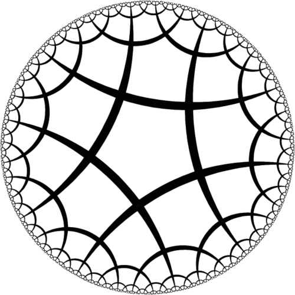
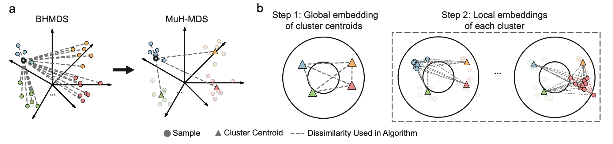

# Multiscale Hyperbolic MDS (MuH-MDS): Overview and Intuition

## What is MuH-MDS?

Multiscale Hyperbolic MDS (MuH-MDS) is a scalable algorithm for embedding high-dimensional data into low-dimensional hyperbolic space. It addresses the challenge of visualizing and analyzing large-scale datasets with hierarchical or tree-like structure by leveraging “adiabatic” approximation from physics to optimize local positions while keeping cluster centroid fixed.

### The Problem: Embedding High-Dimensional Data

High-dimensional biological and network data often contain intrinsic hierarchical structures, such as:
- Cellular differentiation trajectories in single-cell RNA-seq data
- Phylogenetic relationships in evolutionary biology
- Network hierarchies in social or biological networks
- Ontological relationships in knowledge graphs

Traditional dimensionality reduction methods (PCA, t-SNE, UMAP) operate in Euclidean space. These methods face a fundamental trade-off: preserving local neighborhoods often comes at the cost of distorting global structure.

### Why Hyperbolic Space?

Hyperbolic space provides a natural geometric structure for representing hierarchical data. Key properties include:

1. **Exponential Volume Growth**: Unlike Euclidean space where volume grows polynomially, hyperbolic space volume grows exponentially with radius. This allows both local neighborhoods and global hierarchical relationships to be preserved simultaneously.

2. **Natural Representation of Trees**: Hyperbolic space is a continuous version of hierarchical trees. Therefore, it is naturally suited for embedding of hierarchical data, whereas Euclidean embeddings of trees necessarily introduce significant distortion.

  

  <em>Figure 1. Hyperbolic space expands exponentially.</em>

### The Multiscale Approach

The multiscale strategy addresses computational scalability by decomposing the embedding problem into hierarchical layers:

1. **Hierarchical Decomposition**: The dataset is organized into a hierarchy of clusters at multiple resolutions
2. **Coarse-to-Fine Embedding**: Starting from the coarsest level, each layer is embedded progressively, using the previous layer as initialization
3. **Computational Efficiency**: This approach reduces the complexity from O(N^2) to approximately O(N^1.33) for N data points

The multiscale framework enables MuH-MDS to handle datasets with tens of thousands of points while maintaining embedding quality.

## How Does It Work?

The MuH-MDS algorithm consists of three main stages:

  

  <em>Figure 2. The MuH-MDS Algorithm.</em>

### Clustering (Fig. 2a)

The algorithm begins by **clustering** the data:

**For feature matrices** (recommended):
- K-means clustering creates hierarchical partitions
- Multiple resolutions specified by **cluster counts** at each level
- Example: 800 → 100 → 3 creates a three-level hierarchy

**For distance matrices**:
- Agglomerative clustering with distance thresholds
- **Thresholds** control the granularity at each level
- Example: thresholds [0.2, 0.6] creates a two-level hierarchy

The clustering captures the data's intrinsic hierarchical organization, forming the foundation for multiscale embedding.

### Layer-by-Layer Embedding (Fig. 2b)

MuH-MDS embeds data progressively from coarse to fine resolution:

*In this paper, we only discuss the two layer senario (cluster centroids -> individual samples), since it is sufficient for our use cases.*

1. **Step 1: Global Embedding (Cluster centroids)**: Cluster centroids at the coarsest level are embedded directly into hyperbolic space using optimization

2. **Step 2: Local Embedding (Individual samples)**: For each cluster:
   - Cluster centroid embeddings provide initialization
   - Samples in each cluster are embedded around centroid positions 
   - Global positions are preserved using k-nearest neighboring cluster centroids

**Key parameters**:
- `--neighbors`: Number of nearest neighbors at each layer (affects local vs. global balance)
- `--dimension`: Target embedding dimensionality (typically 2 or 3 for visualization)

### Handling cluster sizes for efficiency
MuH-MDS provides flexible outlier handling and cluster size control:

**Outlier Handling**:
- Points in small clusters (< `min-cluster-size`) can be treated as outliers
- Outliers are not included in the above global-local embeddings
- Outliers are mapped based on their k-nearest neighbors after the glocal-local embedding
- This preserves local structure while avoiding noise in clustering

**Cluster Re-division**:
- Large clusters (> `max-cluster-size`) are automatically subdivided
- Ensures computational tractability at each layer
- Maintains embedding quality across scale ranges

The final output is a complete low-dimensional hyperbolic embedding of all data points.

## When Should You Use MuH-MDS?

### Ideal Use Cases

MuH-MDS excels in scenarios with:

1. **Hierarchical Structure**:
   - Single-cell differentiation trajectories
   - Phylogenetic trees and evolutionary data
   - Developmental time series
   - Network hierarchies

2. **Visualization Needs**:
   - Understanding global structure alongside local relationships, especially when the data is expected to be hierarchical
   - Exploring multi-scale organization
   - Comparing hierarchical relationships across datasets

### Advantages Over Traditional Methods

**Compared to Euclidean Methods (t-SNE, UMAP)**:
- Better preservation of **hierarchical** and **global structure**
- Natural and interpretable representation of tree-like relationships
- Less distortion of branching patterns

**Compared to Standard Hyperbolic Embedding**:
- Computational scalability (O(N^1.33))
- Handles datasets with 50,000+ points
- Maintains embedding quality at large scales

### Limitations and Considerations

- Data lacks hierarchical structure (uniform distributions, simple clusters)

When hierarchical structure is weak or absent in the data, MuH-MDS naturally adapts by fitting curvature values close to zero, causing embeddings to concentrate near the origin where hyperbolic geometry locally approximates Euclidean space, and thus avoiding the introduction of artificial hierarchy.

While MuH-MDS handles zero-curvature dataset, one might benefit less from the hierarchical interpretations from MuH-MDS since the data itself lacks hierarchy. In that case, Euclidean methods suffice.  

## Key Concepts

### Distance Matrices vs. Feature Matrices

MuH-MDS accepts two input formats:

**Feature Matrices** (recommended):
- Each row is an observation, each column is a feature
- More computationally efficient
- Example: Gene expression matrix (cells × genes)
- Euclidean distances computed internally

**Distance Matrices**:
- Pairwise distances between all observations
- Required when custom distance metrics are needed
- Example: Phylogenetic distances, graph distances
- More flexible, but **computationally intensive** for both clustering and distance matrix deriving

The choice depends on your data format and whether custom distances are required.

### The Poincaré Ball Model

MuH-MDS uses the Poincaré ball model of hyperbolic space:

- **Representation**: Points lie within a **unit ball**
- **Distance**: Hyperbolic distance grows rapidly near the boundary
- **Curvature**: Constant negative curvature parameterized by λ (learned from data)
- **Coordinates**: The algorithm returns standard Cartesian coordinates in Poincaré ball model 

The Poincaré ball provides a convenient representation for:
- Visualization (points are bounded by 1)
- Computation (standard optimization methods apply)
- Interpretation (radial distance ≈ hierarchy depth)

---

**Next Steps**: See [Example Usage](2-Example%20Usage.md) for hands-on examples and [Parameters](3-Parameters.md) for detailed hyperparameter selection guidance.
