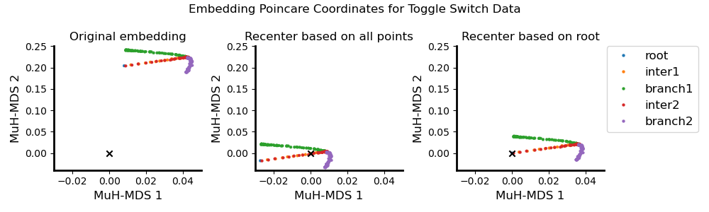
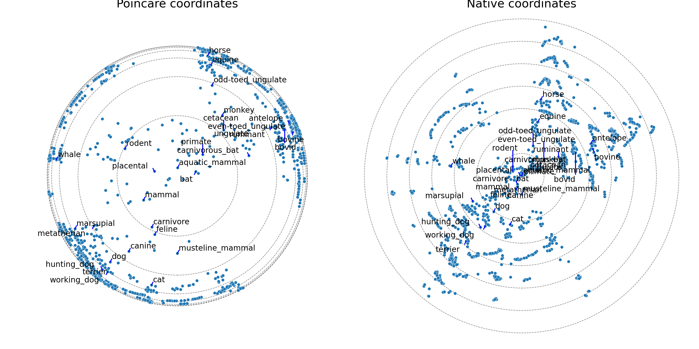

# Example Usage Guide

This guide walks you through using MuH-MDS with two complete examples:
- **Toggle Switch**: Feature matrix workflow demonstrating synthetic gene regulatory network data
- **WordNet Mammals**: Distance matrix workflow showcasing hierarchical taxonomy embedding

By the end of this tutorial, you will understand:
- How to prepare data, run clustering and embedding
- How to visualize results in hyperbolic space
- How to choose recentering methods
- How to choose poincare v.s. native coordinates

## Prerequisites

Before starting, ensure you have:
- Python 3.8+ with required dependencies installed (see [ReadMe](../ReadMe.md))
- CmdStanPy 1.1.0 and compiled Stan models (see [ReadMe](../ReadMe.md) Quick Start)

**Interactive Tutorial**: For hands-on code and visualizations, see the companion Jupyter notebook: [example-usage.ipynb](example-usage.ipynb)

---

## Example 1: Toggle Switch (Feature Matrix)

### 1.1 Understanding the Dataset

The Toggle Switch dataset represents a synthetic gene regulatory network with bistable behavior. This is a classic example from systems biology where cells can exist in two stable states.

**Dataset characteristics**:
- **Type**: Feature matrix (samples × features)
- **Size**: 200 cells (rows) × 2 gene expression features (columns)
- **Structure**: Two-state system with intermediate transitions
- **Location**: `data/FeatMat_ToggleSwitch/FeatMat_ToggleSwitch.txt`

This dataset demonstrates how MuH-MDS captures trajectory-like structures in high-dimensional feature space. The hyperbolic embedding should reveal the two stable states and the transition paths between them.

To inspect the data:
```bash
# Check dimensions
wc -l ../data/FeatMat_ToggleSwitch/FeatMat_ToggleSwitch.txt
head -n 3 ../data/FeatMat_ToggleSwitch/FeatMat_ToggleSwitch.txt
```

### 1.2 Step 1: Hierarchical Clustering

Navigate to the feature matrix workflow directory and generate clusters:

```bash
cd ../MultiscalehMDS_feature
python Generate_cls.py --featmat FeatMat_ToggleSwitch.txt --n-clusters 20
```

**What this does**:
- Performs K-means clustering on the feature matrix
- Creates a single hierarchical layer with 20 clusters
- Saves cluster assignments to `cls_20`

**Parameter explanation**:
- `--featmat`: Name of the feature matrix file (must be in `../data/FeatMat_ToggleSwitch/`)
- `--n-clusters 20`: Creates 20 clusters at the coarsest level

**Output**: A file named `cls_20` containing cluster assignments for each sample, in `../data/FeatMat_ToggleSwitch/` 

**Inspecting results**:
```bash
# View cluster assignments
head cls_20
```
### 1.3 Step 2: Multiscale Embedding

Run the embedding algorithm:

```bash
python Multiscale_hmds.py --featmat FeatMat_ToggleSwitch.txt --clusters cls_20 \
       --neighbors 10 --dimension 2 --min-cluster-size 1 --max-cluster-size 400 \
       --save-matrix --compute-metrics --outlier-neighbors 10
```

**Parameter breakdown**:
- `--featmat FeatMat_ToggleSwitch.txt`: Input feature matrix
- `--clusters cls_20`: Use the cluster assignments we just generated
- `--neighbors 10`: Use 10 nearest neighbors for local geometry
- `--dimension 2`: Embed into 2D hyperbolic space for visualization
- `--min-cluster-size 1`: Minimum cluster size (1 = embed all samples)
- `--max-cluster-size 400`: Maximum cluster size before refining (to avoid too large clusters)
- `--save-matrix`: Save embedding coordinate matrix for visualization
- `--compute-metrics`: Calculate embedding quality metrics (Qlocal, Qglobal)
- `--outlier-neighbors 10`: Neighbors used for outlier mapping (not used when min-cluster-size = 1)

**Expected runtime**: ~2-5 seconds on a standard laptop

**Output location**: `./test/FeatMat_ToggleSwitch/`

### 1.4 Understanding the Output

The embedding produces several files in `test/FeatMat_ToggleSwitch/`:

**Coordinate files**:
- `cls_20_Nn_10_Nd_2_min_1_max_400_coords_20.txt`: Coordinates of cluster centroids (20 points)
- `cls_20_Nn_10_Nd_2_min_1_max_400_coords_200.txt`: Individual sample coordinates (200 points)

**Index file**:
- `cls_20_Nn_10_Nd_2_min_1_max_400_inds_after_prep.txt`: Ordering information mapping embedded points back to original samples

**Metrics file**:
- `cls_20_Nn_10_Nd_2_min_1_max_400_metrics.csv`: Quality metrics including:
  - `Qlocal`: Local neighborhood preservation (higher is better, 0-1)
  - `Qglobal`: Global distance preservation (higher is better, 0-1)
  - `correlation`: Correlation between original and embedded distances
  - `curvature`: Estimated curvature of the hyperbolic space

**File naming convention**: `cls_<clusters>_Nn_<neighbors>_Nd_<dim>_min_<minsize>_max_<maxsize>_<type>_<id>.txt`

### 1.5 Visualizing Results

Load and visualize the embedding using the companion Jupyter notebook ([example-usage.ipynb](example-usage.ipynb))

**Visualization Result**: 
- Points distributed in a disk (Poincaré disk model)
- Two major regions representing the bistable states
- Transition paths between states

**Re-centering of embedding**: Since hyperbolic space is not "flat" (as in Euclidean space), the shape of embedding depends on where the root (center) of the space is. Therefore, it is important to recenter the data for better visualization. We can try two approaches for recentering:
- Recenter based on the center-of-mass (CoM) of all points
- Recenter based on the CoM of a certain (group of) point(s). This usually applies to the case when we have **prior knowledge** of the data, such as which point (or a subgroup of points) is known to be the "root" of the data. For example, stem cells. 

In the Toggle Switch example, we tried both recentering methods. 
- (Left) Embedding without recentering are located off the origin of space. 
- (Middle) Embedding based CoM of all points suggests three branches from the origin
- (Right) Embedding based on the known root suggests one transition paths which then differentiates into two branches. 

<p align="center">
  
</p>

<p align="center">
  <em>Figure 1. Toggle Switch embedding in 2D hyperbolic space, showing two stable states and transition trajectories.</em>
</p>

**Quality metrics interpretation**:
- Qlocal > 0.99: Excellent local structure preservation
- Qglobal > 0.99: Good global structure preservation
- High correlation (>0.99): Distances well-preserved

---

## Example 2: WordNet Mammals (Distance Matrix)

### 2.1 Understanding the Dataset

The WordNet Mammals dataset represents a hierarchical taxonomy from the WordNet lexical database. This is a tree-like structure where species are grouped by biological classification (order, family, genus).

**Dataset characteristics**:
- **Type**: Distance matrix (pairwise distances)
- **Size**: 1180 mammal species
- **Location**: `data/DistMat_mammalwords/DistMat_mammalwords.txt`
- **Distances**: Graph distances in the WordNet taxonomy tree

This dataset demonstrates how MuH-MDS excels at embedding hierarchical data. The hyperbolic geometry naturally represents tree-like structures, with hierarchy levels encoded by radial distance from the origin.

### 2.2 Data Preparation

The distance matrix is pre-computed:
- **Rows/Columns**: Species (same ordering)
- **Values**: Graph distances (number of edges between species in the original tree)

To inspect the data:
```bash
# Check dimensions
wc -l ../data/DistMat_mammalwords/DistMat_mammalwords.txt
```

### 2.3 Step 1: Hierarchical Clustering

Navigate to the distance matrix workflow directory and generate clusters:

```bash
cd ../MultiscalehMDS_distance
python Generate_cls.py --distmat DistMat_mammalwords.txt --thresholds 0.4
```

**What this does**:
- Performs agglomerative (hierarchical) clustering on the distance matrix
- Creates clusters by cutting the dendrogram at distance threshold 0.4
- Saves cluster assignments to `cls_0.4`

**Parameter explanation**:
- `--distmat`: Name of the distance matrix file (must be in `../data/DistMat_mammalwords/`)
- `--thresholds 0.4`: Distance threshold for cutting the dendrogram (smaller = more clusters)

**Difference from feature matrix clustering**: 
- Uses agglomerative clustering (bottom-up merging) instead of K-means, since K-means requires feature matrix
- Works directly with pairwise distances, not feature vectors
- Threshold controls granularity (not explicit cluster count). Larger threshold means less clusters and more coarse granularity. 

**Output**: A file named `cls_0.4` containing cluster assignments.

### 2.4 Step 2: Multiscale Embedding

Run the embedding algorithm:

```bash
python Multiscale_hmds.py --distmat DistMat_mammalwords.txt --clusters cls_0.4 \
       --neighbors 60 --dimension 2 --min-cluster-size 1 --max-cluster-size 300 \
       --save-matrix --compute-metrics --outlier-neighbors 10
```

**Parameter breakdown**:
- `--distmat DistMat_mammalwords.txt`: Input distance matrix
- `--clusters cls_0.4`: Use the cluster assignments from threshold 0.4
- `--neighbors 60`: Use 60 neighbors (higher than Toggle Switch due to more samples)
- `--dimension 2`: Embed into 2D hyperbolic space
- `--min-cluster-size 1`: Embed all species
- `--max-cluster-size 300`: Maximum cluster size before refining
- `--save-matrix`: Save matrices for analysis
- `--compute-metrics`: Calculate quality metrics
- `--outlier-neighbors 10`: Neighbors for outlier mapping (not used when min-cluster-size = 1)

**Expected runtime**: ~1-2 minutes

**Output location**: `./test/DistMat_mammalwords/`

### 2.5 Understanding the Output

The output structure is identical to Example 1:
- Coordinate files: `cls_0.4_Nn_60_Nd_2_min_1_max_300_coords_*.txt`
- Index file: `*_inds_after_prep.txt`
- Metrics file: `*_metrics.csv`

### 2.6 Visualizing Results

Visualize using the companion notebook ([example-usage.ipynb](example-usage.ipynb)).

**Visualization Result**:
- Clear hierarchical layers from center to edge
- Taxonomic groups form angular sectors
- For instance, feline and canine nodes are positioned close to carnivore

**Poincare coordinate v.s. native coordinate: How to choose**
We use the WordNet example as an illustration for the difference between Poincare and native coordinates. 
- The Poincare coordinates is bounded to radius = 1. Therefore, distances are increasingly distorted near the boundary: Euclidean distances near ∥x∥ ≈ 1 correspond to very large hyperbolic distances. One can see this from the embedding by how "hunting_dog", "terrier" and "working_dog" are so close to each other (left), while they are actually separated and the difference can be tell from the native coordinates (right)
- Poincare coordinates emphasis more details around the root, while compress the boundary. 
- Native coordinates reflect information around the boundary better.
- For visualization, we typically prefer native coordinates because radial distance directly corresponds to hyperbolic distance and hierarchy depth, whereas the Poincare ́ model compresses large hyperbolic distances near the boundary, making relative depths harder to interpret quanti- tatively.

<p align="center">
  
</p>

<p align="center">
  <em>Figure 2. WordNet embedding in 2D hyperbolic space, by Poincare coordinates (left) or native coordinates (right). Circles are with native coordinate radii increasing by 1. </em>
</p>


**Quality metrics interpretation**:
- Qlocal > 0.49: Fair local structure preservation. Higher value is expected when increasing embedding dimension from 2 to 3. 
- Qglobal > 0.82: Good global structure preservation
- High correlation (>0.80): Distances well-preserved

---

## Working with Your Own Data

### 3.1 Feature Matrix Requirements

**When to use**: You have high-dimensional measurements (gene expression, images, text embeddings, etc.) and want to discover hierarchical structure.

**Format specifications**:
- **File format**: Tab-separated text file (`.txt`)
- **Structure**: Rows = samples, Columns = features
- **No headers**: Pure data matrix (no row/column names)
- **Data type**: Numeric values (floats or integers)
- **Location**: Place in `data/FeatMat_MyData/FeatMat_MyData.txt`

**Recommended preprocessing**:
1. **Normalization**: Standardize features. For example, for bioinformatics data, please follow the common preprocessing pipeline (quality control, lognormal, PCA...). 
2. **Dimensionality reduction**: Use PCA if features > 100 (keep 50-100 PCs)
3. **Quality control**: Remove outliers, filter low-quality samples

**Example format**:
```
0.523    1.234    -0.891    ...
-1.023   0.456    0.234     ...
0.789    -0.123   1.456     ...
...
```

### 3.2 Distance Matrix Requirements

**When to use**: You have pairwise distances/dissimilarities (graphs, networks, phylogenies, etc.) and want to embed the relational structure.

**Format specifications**:
- **File format**: Tab-separated text file (`.txt`)
- **Structure**: Symmetric matrix (N × N)
- **No headers**: Pure distance matrix
- **Values**: Non-negative distances (0 = identical, larger = more dissimilar)
- **Location**: Place in `data/DistMat_MyData/DistMat_MyData.txt`

**Valid distance metrics**:
- Graph distances (shortest paths)
- Phylogenetic distances
- Edit distances (strings, sequences)
- Dissimilarity measures (1 - correlation, etc.)

**Important**: 
- **Must satisfy triangle inequality** (or be close)
- Diagonal should be zeros
- Matrix must be symmetric

**Example format**:
```
0.0    1.5    3.2    ...
1.5    0.0    2.1    ...
3.2    2.1    0.0    ...
...
```


### 3.3 Parameter selection: quick guidelines

| Dataset Size | Neighbors | Clusters | Max Cluster Size |
|--------------|-----------|----------|------------------|
| < 1,000      | 5-10      | 10-20    | 200-400          |
| 1,000-10,000 | 10-30     | 20-50    | 200-500          |
| > 10,000     | 30-100    | 50-100   | 500-1000         |

**Start simple**:
1. Use defaults for first run
2. Visualize results
3. Adjust parameters based on quality metrics
   - If local structure is poor: increase `--neighbors`
   - If visualization is cluttered: increase `--dimension` to 3D or 5D
   - If runtime is too long: decrease `--neighbors` or increase `--max-cluster-size`
4. Iterate to optimize

For detailed parameter tuning, see [Parameter Guide](3-Parameters.md).

---
**Resources**:
- Check the [ReadMe](../ReadMe.md) for installation issues
- Review [Parameter Guide](3-Parameters.md) for tuning advice
- Examine the Jupyter notebook ([example-usage.ipynb](example-usage.ipynb)) for working examples