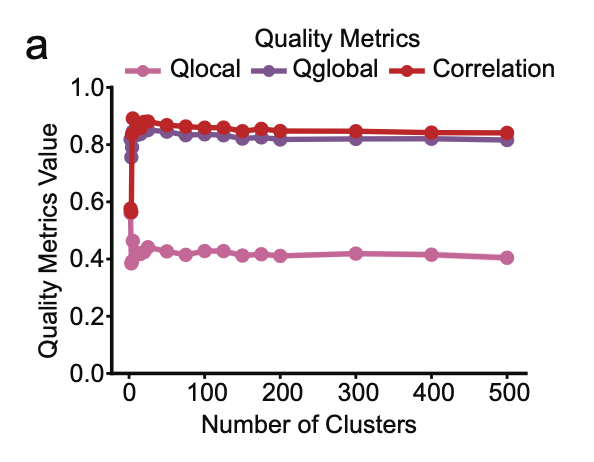
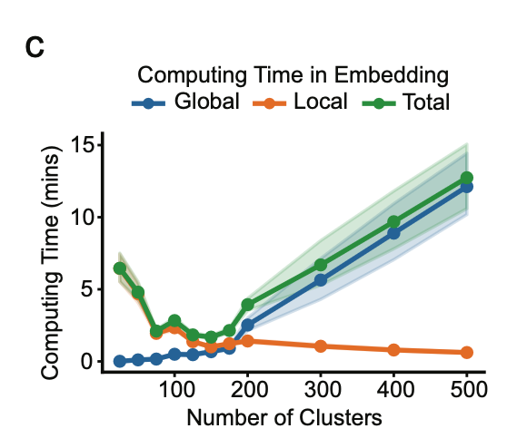
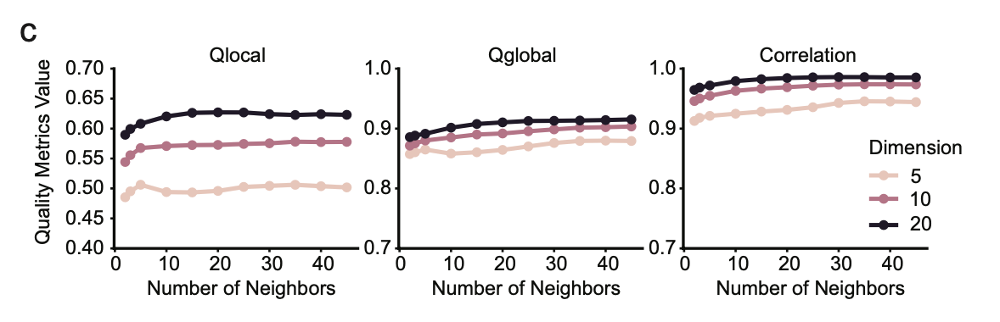
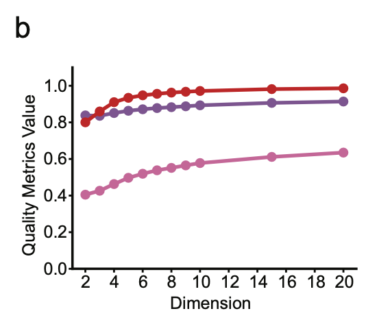
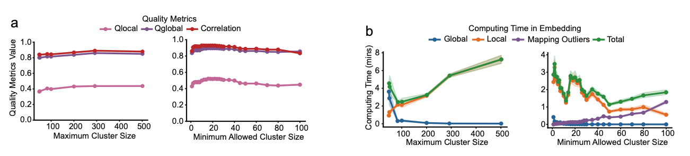

# Parameter Selection Guide

This guide provides detailed recommendations for tuning MuH-MDS parameters to optimize embedding quality and computational efficiency. For basic usage examples, see [Example Usage Guide](2-Example%20Usage.md).

## Quick Reference Tables

### Core Parameters by Dataset Size

| Dataset Size | Number of Clusters | Dimensions | Max Cluster Size | Min Cluster Size | 
|--------------|-------------------|------------|------------------|------------------|
| < 1,000 | 10-100 | 2-3 | 200-400 | 1 |
| 1,000-10,000 | 100-200 | 3-5 | 200-500 | 3 |
| 10,000-50,000 | 200-300 | 3-10 | 500-1000 | 3 |
| > 50,000 | 300-800 | 5-10 | 400-500 | 3-5 |

**Note**: The optimal number of clusters for computational efficiency is approximately $n^{2/3}$, where $n$ is the dataset size.

### Number of Neighbors by Dimension

| Embedding Dimension | Recommended Neighbors |
|---------------------|----------------------|
| 2-3 | 30 |
| 4-10 | 50 |
| 10-20 | 75 |

**Rule of thumb**: Use at least `dimension × 3` neighbors for high-dimensional embeddings.

---

## Boolean Flags

### `--save-matrix`
**Purpose**: Save embedding coordinate matrices to disk.

**Recommendation**: Always include this flag (default: False).

**Usage**: 
```bash
python Multiscale_hmds.py ... --save-matrix
```

### `--compute-metrics`
**Purpose**: Calculate embedding quality metrics (Qlocal, Qglobal, correlation).

**Recommendation**: Include for quality assessment, omit for very large datasets.
- Computational complexity: $O(N^2)$, can be time-consuming when $N > 40,000$
- Skip for initial exploratory runs on large datasets

**Usage**:
```bash
# Include metrics (default behavior)
python Multiscale_hmds.py ... --compute-metrics

# Skip metrics for speed
python Multiscale_hmds.py ...  # omit flag
```

### `--map-outlier`
**Purpose**: Remap excluded outliers back to embedding space after global-local embedding.

**Recommendation**: Include when `--min-cluster-size > 1`.
- Outliers (clusters smaller than min-cluster-size) are initially excluded
- This flag remaps them based on $k$-nearest neighbors in the embedded space
- The $k$ value is set by `--outlier-neighbors`

**Usage**:
```bash
python Multiscale_hmds.py ... --min-cluster-size 3 --map-outlier --outlier-neighbors 10
```

---

## Detailed Parameter Guidance

### Number of Clusters (`--n-clusters` / `--thresholds`)

**What it controls**: The number of clusters that the data points are divided into. 

**Impact on quality**:
- Embedding quality metrics are sensitive to cluster count only when very small (< 10 clusters)

**Impact on runtime**:
- Computational time varies significantly with cluster count
- **Optimal value**: Approximately $n^{2/3}$ for best global-local embedding time trade-off

**Feature matrix workflow** (K-means, Specify exact number of clusters):
```bash
python Generate_cls.py --featmat MyData.txt --n-clusters 150
```

**Distance matrix workflow** (Agglomerative clustering, Specify distance threshold instead of cluster count):
```bash
python Generate_cls.py --distmat MyData.txt --thresholds 0.4
```
- Start with `threshold = 0.4` and examine resulting cluster count. Iterate to achieve approximately $n^{2/3}$ clusters

**Recommendations**:
- **< 1,000 samples**: 10-100 clusters
- **1,000-10,000 samples**: 100-200 clusters (aim for $n^{2/3}$)
- **10,000-50,000 samples**: 200-300 clusters
- **> 50,000 samples**: 300-800 clusters

<p align="center">
  
</p>
<p align="center">
  <em>Figure 1a: Embedding quality (Qlocal and Qglobal) vs. number of clusters. Quality is insensitive to cluster count when sufficient clusters are used (> 10).</em>
</p>

<p align="center">
  
</p>
<p align="center">
  <em>Figure 1b: Computational time vs. number of clusters for 2730 samples. Optimal cluster count (n<sup>2/3</sup>) minimizes runtime while maintaining quality.</em>
</p>

---

### Number of Neighbors (`--neighbors`)

**What it controls**: The number of nearest neighboring clusters used to constrain local geometry during embedding.

**Impact on quality**:
- Sensitivity depends on embedding dimension: More neighbors are needed in higher dimensions to uniquely determine point positions

**Recommendations**:
- **2D-3D embeddings**: 20-30 neighbors (sufficient for visualization)
- **4D-10D embeddings**: 50 neighbors
- **10D-20D embeddings**: 75 neighbors
- **General rule**: Use at least `dimension × 3` neighbors

**Example**:
```bash
# Low-dimensional visualization
python Multiscale_hmds.py ... --neighbors 30 --dimension 3

# High-dimensional embedding
python Multiscale_hmds.py ... --neighbors 75 --dimension 15
```

<p align="center">
  
</p>
<p align="center">
  <em>Figure 2: Embedding quality vs. number of neighbors for different dimensions. As dimension increase from 5D to 20D, it requires more neighbors to better constraint the embedding in high dimensions.</em>
</p>

---

### Embedding Dimension (`--dimension`)

**What it controls**: The dimensionality of the hyperbolic embedding space.

**Impact on quality**:
- **Qlocal** (local structure): Improves monotonically with dimension
  - More dimensions = more capacity to capture fine details
- **Qglobal and Correlation**: Saturates around D = 4
  - Hyperbolic geometry captures most global information in as low as 3-4 dimensions

**Key insight**: Hyperbolic space is remarkably efficient at representing global structure in just 2-3 dimensions, unlike Euclidean methods which often require many more dimensions.

**Trade-offs**:
- **2D**: Best for visualization, but may not fully capture local structures for large datasets 
- **3D**: Optimal balance between visualization and detail preservation
- **5D-10D**: Capture complex structures, require dimensionality reduction for visualization

**Recommendations**:
- **For visualization**: Use 2D or 3D (preferred: 3D)
- **For maximum quality**: Use 4D-10D for best quality. Further dimension reduction required for visualization. 

**Example**:
```bash
# Visualization-focused
python Multiscale_hmds.py ... --dimension 2 --neighbors 30

# If want higher quality:
python Multiscale_hmds.py ... --dimension 5 --neighbors 50
```

<p align="center">
  
</p>
<p align="center">
  <em>Figure 3: Embedding quality vs. dimension. Qlocal continues improving, while Qglobal and correlation saturates at D=4, demonstrating hyperbolic space's efficiency at capturing global structure.</em>
</p>

---

### Maximum Cluster Size (`--max-cluster-size`)

**What it controls**: The maximum allowed size for clusters before subdivision.

**Purpose**: Prevent extremely large clusters that would slow down local embedding steps.

**How it works**:
- During hierarchical refinement, clusters exceeding this size are subdivided
- Creates a more balanced cluster size distribution
- Significantly reduces embedding time for large clusters

**Impact on runtime**:
- **Too small (~100)**: Over-subdivision increases global embedding time
- **Too large (~1000)**: Large clusters slow down local embedding steps
- **Optimal (~400)**: Balances local and global computational costs

**Impact on quality**:
- Minimal quality impact when set appropriately

**Recommendations**:
- **Default**: 400 (works well for most datasets)
- **Always use**: `--max-cluster-size ≤ 400` to avoid clusters > 500
- **Large datasets (>50,000)**: Can use 400-500
- **Small datasets (<3,000)**: Can use 200-300

**Example**:
```bash
python Multiscale_hmds.py ... --max-cluster-size 400
```

<p align="center">
  
</p>
<p align="center">
  <em>Figure 4: Impact of cluster size control on embedding quality and runtime. Appropriate bounds on cluster sizes optimize both metrics.</em>
</p>

---


### Min Cluster Size (`--min-cluster-size`)
**What it controls**: The minimal allowed cluster size. 

**Purpose**: Very small clusters provide poor constraints and can degrade centroid-based global structure. This parameter avoids very small clusters increase number of clusters and slow down global embedding step. 

**How it works**:
- Clusters smaller than this size will be filtered out before global-local embedding. 
- If needed, they can be remapped to the space after other clusters have been embedded. 
- **No filtering (min-cluster-size = 1)**: None of the clusters are excluded, may increase global embedding time significantly and reduce embedding quality. 
- **Filter very small clusters (min-cluster-size = 3)**: Fair control of filtering, benefits both quality and embedding time
- **Filter medium size clusters (min-cluster-size = 10)**: May increase time in remapping and lose information in those clusters filtered

**Impact on runtime**:
- Reduce running time when chosen properly

**Impact on quality**:
- Optimize quality when optimal running time is obtained (Fig. 4)

**Recommendations**:
- For small datasets (size < 3,000) it is acceptable to use `min-cluster-size = 1`, for large datasets we suggest using `min-cluster-size = 3`.

## Troubleshooting Common Issues

### 1. Low Quality Metrics

**Problem**: Qlocal < 0.5 or Qglobal < 0.6

**Solutions**:
- **For low Qlocal**: 
  - Increase `--neighbors`
  - Decrease `--min-cluster-size` to avoid filtering too many "outliers"
  - Try higher dimensions (3D or 5D instead of 2D)
- **For low Qglobal**: 
  - Increase `--neighbors`
- **Applies to both cases**:
  - Remove extreme outliers before embedding
  - Normalize features (zero mean, unit variance)
  - For distance matrices: verify symmetry, non-negativity, and triangle inequality

### 2. Slow Runtime

**Problem**: Embedding takes > 20 minutes for dataset < 10,000 samples

**Solutions**:
- **Optimize cluster count**: Aim for $n^{2/3}$ clusters
- **Control cluster sizes**:
  - Set `--max-cluster-size 400` to subdivide large clusters (prevents slow local steps)
  - Set `--min-cluster-size 3` to exclude very small clusters (speeds up global step)
- **Reduce neighbors**: Use 20-30 for 2D/3D instead of 50+
- **Skip metrics**: Omit `--compute-metrics` flag (saves $O(N^2)$ time)

### 3. Poor Visualization

**Problem**: Points clustered in center, at boundary, or with poor separation

**Diagnosis**:
- **Points concentrated at center**: 
  - Insufficient hierarchical structure in data
  - Data may be inherently flat (Euclidean)
- **Points pushed to boundary**: 
  - Extreme distance values in input
  - Numerical issues during optimization
- **Poor separation**: 
  - Insufficient dimensions to capture structure
  - Suboptimal parameter choices
- **Coloring by metadata does not make sense**:
  - Check if the embedded points have been properly re-ordered to the original order. 
  Example:
  ```python
  result_dir = '../MultiscalehMDS_feature/test/FeatMat_ToggleSwitch/'
  prefix = 'cls_20_Nn_10_Nd_2_min_1_max_400'
  nsample = 200

  pcoords = np.loadtxt(result_dir+prefix+'_coords_%i.txt'%nsample)
  inds = np.loadtxt(result_dir+prefix+'_inds_after_prep.txt')

  # reorder pcoords to match original data order
  pcoords = pcoords[np.argsort(inds)]
  ``` 

**Solutions**:
- **Convert coordinates**: Use `to_native()` function
  ```python
  import MHMDS.embed_funs as emb
  native_coords = emb.to_native(poincare_coords)
  ```
  - Extreme distance values in input
- **Check embedding quality**: Inspect metrics file - low metrics indicate failed embedding
- **Try higher dimensions**: Use 3D instead of 2D for complex structures

### Parameter Selection Workflow

1. **Determine dataset size** $n$ and calculate target cluster count $\approx n^{2/3}$
2. **Generate clusters**: Use `Generate_cls.py` with appropriate method (K-means or agglomerative)
3. **Choose dimension**: 2D for simple visualization, 3D for quality, 5D+ for maximum detail
4. **Set neighbors**: 30 for 2D, 50 for 3D-5D, 75+ for high dimensions or hierarchical data
5. **Set cluster size bounds**: `--max-cluster-size 400` and `--min-cluster-size 3` (for n > 3,000)
6. **Run embedding**: Include `--save-matrix`, `--compute-metrics`, and `--map-outlier` flags
7. **Visualize results**: Convert coordinates with `to_native()` and assess quality metrics
8. **Iterate if needed**: Adjust parameters based on troubleshooting guide above

## Resources
- **Algorithm intuition**: See [1-Overview.md](1-Overview.md) for conceptual background
- **Example usage**: See [2-Example Usage.md](2-Example%20Usage.md) for hands-on tutorials
- **Interactive examples**: Run [example-usage.ipynb](example-usage.ipynb) for working code for 2-Example Usage.md
- **Source code**: Explore `MHMDS/` folder for implementation details and Stan models

